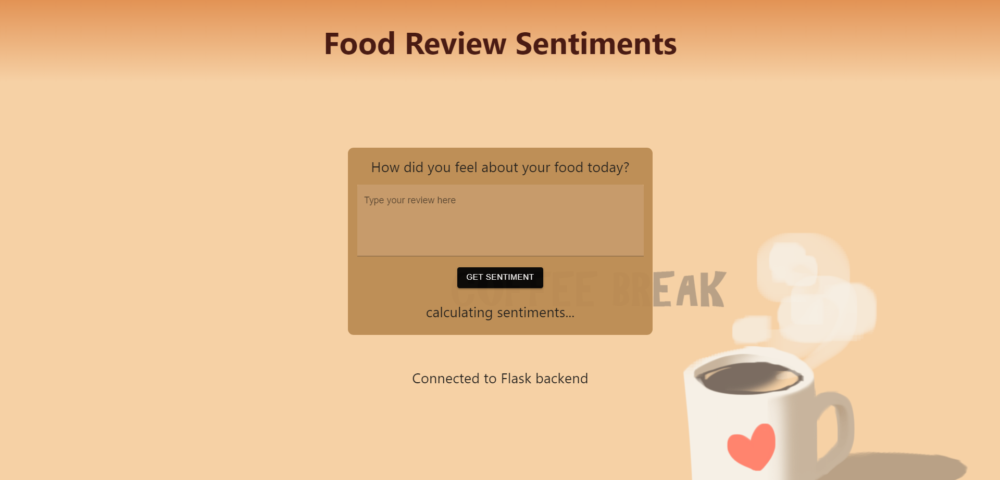

# Introduction
This repository introduces webapp to analyze food review sentiments in Vietnamese. It is built upon a React frontend, a Flask backend, and a Vietnamese bert-base-uncased model from Huggingface.

# Setup
As this repo utilizes `Python` and `node.js`, please ensure that you have both on your system.
1. Run `pip install requirements.txt` to update your environment's dependencies (You should create a new venv for this)
2. Run `cd src/frontend` then run `npm install` to install all required npm packages.

# Running in Python
## Capabilities
- Perform training on the model with the provided datasets (the models are saved afterwards).
- Perform inferencing with a selected text.

The following parameters allow you to modify how you want to run the script:
- `--mode`: String
    - `--mode train` trains the model, `--mode infer` performs inference
- `--model_path`: String
    - `--model_path <PATH>` references the model you want to load weights from (this is only used in inference). You are required to paste the full directory of the model
- `--num_epochs`: Int
    - `--num_epochs <NUM_EPOCHS>` sets the number of epochs you want to train for.
- `--text`: String
    - `--text <TEXT>` infers the inputted text. Please use Vietnamese text.

Run with `python -m src.main <PARAMS>` in the `task_2` folder.

Train example:
- `python -m src.main --mode train --num_epochs 10`

Inference example:
- `python -m src.main --mode infer --model_path "C:\path\to\model\model_2023-01-15_01-15-00.pt" --text "xin chào"`

# Running in your browser (React + Flask)
## Capabilities
- Perform inferencing with a selected text.

1. Start the frontend service by going to the frontend folder `src/frontend` and run `npm start`
2. Start the backend service by going to the src folder `src` and run `flask run`

Upon success, you should see a webpage like this:

Then, key in any food review text in Vietnamese. This calls the inference service in Flask. If your review is positive, you should see something like this:

# Using Docker
### Frontend
- To start the frontend as a docker container:
    - `cd src/frontend`
    - `docker build -f Dockerfile.frontend -t sentiment-fe .`
    - Once building is done, `docker run -p 3000:3000 sentiment-fe`
    - Go to localhost:3000 to see the site

### Backend
- To start the backend as a docker container:
    - `docker build -f Dockerfile.backend -t sentiment-be .` (Do note that you need a CUDA enabled device to build the image)
    - Once building is done, `docker run --gpus 1 -p 5000:5000 sentiment-be` 
    - Do note that if you are running the container for the first time, it takes some time to download the models
    - Refresh the frontend and you should see the message "Connected to Flask backend"

# Flask advantages and disadvantages
### Advantages:
- Flask is relatively straight forward to use, and defining API calls is straightforward.
- It is a micro framework, hence contains lesser abstractions, making it faster
- Good for small scale applications

### Disadvantages:
- No UI to test out API calls unlike FastAPI (which is a full-stack framework)
- May not have as much features as other existing libraries like Django